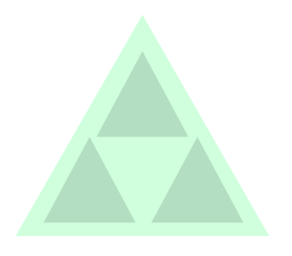
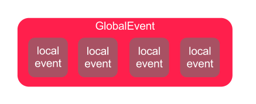

# Backbone.jsでSingle page アプリケーションを作る方法
### How to build single page application with Backbone.js

=================
## <a name='mokuji'>目次</a>
1. [はじめに](#intro)
1. [ディレクトリ構成・使用ライブラリ](#pageStructure)
1. [View分割ポリシー](#viewManagePolicies)
1. [イベント連携ポリシー](#eventManagePolicies)
1. [ワイアーフレーム作成](#makeWireframe)
1. [SearchBarからHistoryへのイベント連携](#searchToHistory)
1. [SearchBarからSearchResultへのイベント連携](#searchToResult)
1. [HistoryからSearchResultへのイベント連携](#historyToResult)
1. [Tabから他のViewへのイベント連携](#tabToOther)
1. [完成](#complate)
 
## <a name='intro'>1.はじめに</a>

このチュートリアルでは、最近話題のクライアントサイドMVCフレームワークのひとつ[Backbone.js](http://backbonejs.org/)を使って、
Gmailのようなシングルページで動作するWebアプリケーションの作成方法について紹介します。

特に、Backbone.jsを作成する際に悩む人が多いとされている、
Viewの分割とViewの間のイベントのやり取りについて重点的に説明します。

> **日本語訳ドキュメントについて**

> backbone.jsのドキュメントは[enjaによる日本語訳版](https://github.com/enja-oss/Backbone/tree/master/docs)もあります。
よろしければ参考にしてください。

### <a name='wireframe'>ワイアーフレーム</a>

このチュートリアルで作成するアプリケーションは、
TwitterなどのWebAPIに対して検索条件を指定して検索結果を表示する単純なアプリケーションです。

画面のイメージは次の通りで、5つのViewで分割しています。（分割ポリシーについては後述します。）


画面の次のような機能があるとします。

* 検索：Webサービスに対してキーワード検索する。検索した場合、検索履歴が追加され、検索結果が表示される。
* 履歴検索：検索履歴をクリックすることで再検索する。
* タブ切り替え：タブを切り替えた場合、その検索サービスで直近に検索されたキーワードで再検索を行う。
* 検索結果の表示：検索サービスごとにタブを分けて表示する。
* 検索履歴の表示：検索されたキーワードを表示する。

<a href='#mokuji'>[:point_up:]</a>

## <a name='pageStructure'>ディレクトリ構成・使用ライブラリ</a>

### ディレクトリ構成

ディレクトリ構成は以下の通りです。

````
App root
│
│  index.html
│  
├─assets
│          
├─css
│  │  main.css
│  └─styl
│          color_thema.styl
│          main.styl
│          
├─hbs
│      footer.hbs
│      history.hbs
│      hotpepper.hbs
│      layout.hbs
│      search_bar.hbs
│      tabs.hbs
│      twitter.hbs
│      
└─js
   │  app.js
   │  namespace.js
   │  
   ├─collections
   │      hotpepper_list.js
   │      search_history_list.js
   │      twitter_list.js
   │      
   ├─models
   │      hotpepper.js
   │      twitter.js
   │      
   ├─templates
   │      layout.js
   │      
   └─views
           footer.js
           history.js
           search_bar.js
           search_results.js
           tabs.js
````

### 使用ライブラリ

以下のライブラリを使用しています。
（任意）となっているライブラリについては、アプリケーションを動かす上で必須ではありませんので、
使用しない、または他のライブラリを採用していただいても結構です。

* javascript
 * Backbone.js
 * Underscore.js
 * jQuery
 * backbone.localStorage.js
 * handlebars.js（任意）
 * moment.js（任意）
 * twitter-text.js（任意）
* css
 * bootstrap.css（任意）
 * bootstrap-narrow.css（任意）

> **ビルドプロセスについて**

> このチュートリアルでは、handlebarsとstylusを使用しています。これらはGrunt.jsを使ってビルドしていますが、このチュートリアルでは詳しく説明しません。
Gruntの設定については、[Gruntfile.js](https://github.com/mitsuruog/SPA-with-Backbone/blob/master/Gruntfile.js)または、
[package.json](https://github.com/mitsuruog/SPA-with-Backbone/blob/master/package.json)を参考にしてください。

<a href='#mokuji'>[:point_up:]</a>

## <a name='viewManagePolicies'>View分割ポリシー</a>



画面を幾つかのパートに分割しSubViewとします。分割する際のポイントは次の通りです。

1. 画面を構造（ヘッダーフッターなど）で分けてSubViewとする。
1. （リストなど）繰り返し項目となるものをSubViewとする。
1. 部分的にコンテンツが置き換わる部分をSubViewとする。
1. コントローラロジックが複雑になりそうな部分を（予め設計して）SubViewとして分割する。

いくつかのSubViewを管理する中間的なViewが必要な場合は、ManagerViewを作成します。

最後に、アプリケーションのトップレベルに1つ、ManagerViewやSubViewを統括するPresidentViewを作成します。

基本的にBackbone.CollecitionやBackbone.ModelはSubViewが所有し、ManagerViewやPresidentViewでは所有しません。
これと逆に、ManagerViewやPresidentViewは、管理対象のViewを所有しますが、SubViewは他のViewを所有しません。

<a href='#mokuji'>[:point_up:]</a>

## <a name='eventManagePolicies'>イベント連携ポリシー</a>



View間の連携はイベントを起点に行います。イベントは大きくLocalイベントとGlobalイベントの2つに分類します。

Localイベントは、イベントが発生したView内部で処理が完結するイベントです。それに対して、他のViewに対して連携する必要があるものをGlobalイベントとします。

Localイベントのハンドリングについては、Backbone.View内のeventsオブジェト内に定義します。

例）
````javascript
events: {
  'click #btn_search': 'search'
},
````

Globalイベントは、Backbone.Eventsを複製したオブジェクト（以下、Mediatorオブジェクト）をアプリケーションにて1つ持ち、Mediatorオブジェクトから発生するイベントをハンドリングします。

例）
````javascript
//　Mediatorオブジェクトの複製
_.extend(MyApp.mediator, Backbone.Events);

//　イベント通知
App.mediator.trigger('globalChange');

//　イベントハンドリング
App.mediator.on('globalChange', someFunction);
````

<a href='#mokuji'>[:point_up:]</a>

## <a name='makeWireframe'>ワイアーフレーム作成</a>

では、早速ワイアーフレームを実装していきます。ソースコードは次の通りです。

**index.html**
````html
<!DOCTYPE html>
<!--[if lt IE 7 ]> <html lang="ja" class="no-js ie6"> <![endif]-->
<!--[if IE 7 ]>    <html lang="ja" class="no-js ie7"> <![endif]-->
<!--[if IE 8 ]>    <html lang="ja" class="no-js ie8"> <![endif]-->
<!--[if IE 9 ]>    <html lang="ja" class="no-js ie9"> <![endif]-->
<!--[if (gt IE 9)|!(IE)]><!--> <html lang="ja" class="no-js"> <!--<![endif]-->
<head>
  <meta charset="utf-8" />
  <meta name="description" content="" />
  <meta name="author" content="" />
  <title>How to build single page application with Backbone.js</title>
  <link href="css/main.css" rel="stylesheet" media="screen" />
</head>
<body>

  <a href="https://github.com/mitsuruog/SPA-with-Backbone.git"></a>
  <!--app root  -->
  <div id="app"></div>
  
  <script type="text/javascript" src="https://ajax.googleapis.com/ajax/libs/jquery/1.9.1/jquery.min.js"></script>
  <!--[if lt IE 9]>
    <script src="http://html5shiv.googlecode.com/svn/trunk/html5.js"></script>
  <![endif]-->
  <script type="text/javascript" src="assets/js/underscore-1.4.4.js"></script>
  <script type="text/javascript" src="assets/js/backbone-0.9.10.js"></script>
  <script type="text/javascript" src="assets/js/handlebars-1.0.0-rc.3.js"></script>
 
  <script type="text/javascript" src="js/namespace.js"></script>
  <script type="text/javascript" src="js/templates/layout.js"></script>
  <script type="text/javascript" src="js/views/search_bar.js"></script>
  <script type="text/javascript" src="js/views/tabs.js"></script>
  <script type="text/javascript" src="js/views/search_results.js"></script>
  <script type="text/javascript" src="js/views/history.js"></script>
  <script type="text/javascript" src="js/views/footer.js"></script>
  <script type="text/javascript" src="js/app.js"></script> 
 
</body>
</html>
````
**js/namespace.js**
````javascript
var MyApp = {
  Models: {},
  Collections: {},
  Vews: {},
  App: {},
  Templates: {}
};
````
**js/app.js**

`App`では、アプリケーションを構築するSubViewやManagerViewを初期化して保持します。
このフェーズでは初期化する際に、各Viewが管理を担当するセレクタを渡すのみです。


````javascript
MyApp.App = Backbone.View.extend({

  el: '#app',

  tmpl: MyApp.Templates.layout,

  initialize: function () {

    this.$el.html(this.tmpl());

    this.history = new MyApp.Views.History({
      el: this.$el.find('#history_list')
    });

    this.searchBar = new MyApp.Views.SearchBar({
      el: this.$el.find('#header')
    });

    this.tabs = new MyApp.Views.Tabs({
      el: this.$el.find('#search_results')
    });

    this.footer = new MyApp.Views.Footer({
      el: this.$el.find('#footer')
    });

  }

});

new MyApp.App();
````
**js/views/search_bar.js**
````javascript
MyApp.Views.SearchBar = Backbone.View.extend({

  tmpl: MyApp.Templates.search_bar,

  initialize: function() {
    this.$el.html(this.tmpl());
  }

});
````

**js/views/history.js**
````javascript
MyApp.Views.History = Backbone.View.extend({

 tmpl: MyApp.Templates.history,

  initialize: function () {
    this.$el.html(this.tmpl());
  }

});
````

**js/views/tabs.js**

`SearchResults`を初期化する際に依存するオブジェクトを渡しています。
これにより`SearchResults`が持つ機能とデータを分離して、検索Webサービスを追加することを容易にします。

````javascript
MyApp.Views.Tabs = Backbone.View.extend({

 tmpl: MyApp.Templates.tabs,

  initialize: function () {
    
    this.$el.html(this.tmpl());

    this.twitters = new MyApp.Views.SearchResults({
      el: this.$el.find('#twitter_list'),
      tmpl: MyApp.Templates.twitter
    });

    this.hotppepers = new MyApp.Views.SearchResults({
      el: this.$el.find('#hotpepper_list'),
      tmpl: MyApp.Templates.hotpepper
    });

  }

});
````

**js/views/search_result.js**

`Tabs`から渡されたテンプレート関数`tmpl`を実行し、管理セレクタ`el`配下にDOMを構築します。

````javascript
MyApp.Views.SearchResults = Backbone.View.extend({

 initialize: function () {
    this.$el.html(this.options.tmpl());
  }

});
````

**js/views/footer.js**
````javascript
MyApp.Views.Footer = Backbone.View.extend({

  tmpl: MyApp.Templates.footer,

  initialize: function() {
    this.$el.html(this.tmpl());
  }

});
````

**hbs/layput.hbs**
````html
<header id="header-wrap">
 <div id="header-container">
    <div id="header">
    </div>
  </div>
</header>

<div id="container">

  <div id="history">
    <div id="history_title"></div>
    <div id="history_list"></div>
  </div>

  <div id="search_results">
  </div>

</div>

<footer id="footer-wrap">
  <div id="footer-container">
    <div id="footer"></div>
  </div>
</footer>
````

**hbs/search_bar.hbs**
````html
Search Bar
````

**hbs/history.hbs**
````html
History
````

**hbs/tabs.hbs**
````html
Tab
<div id="twitter_list"></div>
<div id="hotpepper_list"></div>
````

**hbs/twitter.hbs**
````html
Twitter
````

**hbs/hotpepper.hbs**
````html
Hotppeper
````

**hbs/footer.hbs**
````html
Footer
````

**css/main.css**
````css
@charset "utf-8";
body {
  margin: 0;
  padding: 0;
}
#header-wrap {
  position: fixed;
  top: 0;
  left: 0;
  width: 100%;
}
#header-container {
  height: 34px;
}
#header {
  width: 100%;
  margin: 0 auto;
  position: relative;
}
#container {
  margin: 0 auto;
  overflow: auto;
  padding-top: 35px;
  padding-bottom: 25px;
}
#history {
  float: left;
  width: 30%;
}
#search_results {
  float: right;
  width: 70%;
}
#footer-wrap {
  position: fixed;
  bottom: 0;
  left: 0;
  width: 100%;
}
#footer-container {
  height: 24px;
}
#footer {
  width: 100%;
  margin: 0 auto;
  position: relative;
}
header,
footer {
  border: 1px solid #000;
}
````
これらをブラウザで表示させると、次のようなワイアーフレームが表示されるはずです。


ソースコード一式は[こちらのブランチ](https://github.com/mitsuruog/SPA-with-Backbone/tree/phase-1)で参照できます。

<a href='#mokuji'>[:point_up:]</a>

## <a name='searchToHistory'>SearchBarからHistoryへのイベント連携</a>

これから説明する異なるView間のイベント連携は、イベト連携ポリシーの通りMediatorオブジェクトを仲介して行います。

まず、SearchBarからHistoryへのイベント連携から説明していきます。

ユーザが検索ボタンをクリックした場合、SearchBarは`click`イベントをハンドリングし、Globalイベント`search`を発火します。
Historyでは`search`イベントをハンドリングして、localStorageに検索キーワードなどを記録します。

これらを図にしたものが次の図です。


**js/app.js**

Mediatorオブジェクトを作成して保有します。

`History`を初期化する際に、永続化用のCollectionオブジェクトを渡します。
これは、後々永続化方法をLocalStorageからRDBMSなどに容易に置き換える必要が出た場合、容易に置き換えるためです。

````javascript
MyApp.App = Backbone.View.extend({

  el: '#app',

  tmpl: MyApp.Templates.layout,

  initialize: function () {

    //Mediatorオブジェクト作成
    MyApp.mediator = {};
    _.extend(MyApp.mediator, Backbone.Events);
    
    this.$el.html(this.tmpl());

    this.history = new MyApp.Views.History({
      el: this.$el.find('#history_list'),
      searches: new MyApp.Collections.SearchHistoryList()
    });

  // some...

  }

});

new MyApp.App();
````

**js/views/search_bar.js**

検索ボタンがクリックされた際に発生する`click`イベントをハンドリングして`search()`を呼び出します。

`search()`の内部でGlobalレベルのイベント`search`を発火します。

````javascript
MyApp.Views.SearchBar = Backbone.View.extend({

 tmpl: MyApp.Templates.search_bar,

 //Localイベントのハンドリング
  events: {
    'click #btn_search': 'search'
  },

  // some...

  search: function (e) {

    var $checked = this.$el.find('input[type=radio]:checked'),
      query = $('#query').val(),
      service = $checked.val(),
      search = {};

    e.preventDefault();

    search.query = query;
    search.service = service;

   //「search」イベントを発火する
   MyApp.mediator.trigger('search', search);

  }

});
````

**js/views/History.js**

Globalのイベント`search`をハンドリングして`addHistory()`を呼び出し、
その中でCollectionに検索キーワードなどを1件追加します。
Collectionは内部でLocalStorageと自動的に同期しています。

Collectionを追加すると`add`イベントが発火するので、これをハンドリングして`render()`を呼び出し、画面に描画を行います。

ここでは、`initialize()`で`_.bindAll(this)`を行っています。
これは、異なるViewの連携をMediatorオブジェクトを介したイベント駆動型で実装した場合、javascript特有のthisの喪失が多発します。
_.bindAll()することで、常にthisはViewオブジェクトを指し示します。

また、ユーザの操作からレンダリング`render()`までの処理の流れについては、
一貫して、`ユーザの操作→Collection（またはModel）の更新→レンダリング`の順で処理を行います。
これは、ユーザの操作とレンダリングの間に、Collection（またはModel）の更新を挟むことによって、
ユーザの操作とレンダリングが1つにまとまったスパゲティfunctionの作成を防止するためです。

ユーザの操作、Collection（またはModel）の更新、レンダリングの各処理を疎結合にすることで、
それぞれ依存することなく単独でテストしやすくなります。

_検索履歴の削除ボタンをクリックした際に、LocalStorageから履歴を削除する実装を行っています。
Localイベントを、View自身で処理する際の実装の参考としてください。_

````javascript
MyApp.Views.History = Backbone.View.extend({

  tmpl: MyApp.Templates.history,

  //Localイベントのハンドリング
  events: {
    'click .btn_delete': 'removeHistory'
  },

  initialize: function () {

    _.bindAll(this);

    this.searches = this.options.searches;

    this.searches.fetch();
    this.render();
  
    //Globalイベントをハンドリング
    MyApp.mediator.on('search', this.addHistory);

    //Localイベントをハンドリング
    this.listenTo(this.searches, 'add remove', this.render);

  },

  addHistory: function (search) {

    search.id = +new Date();
    this.searches.create(search);

  },

  removeHistory: function (e) {

    var id = this._getHistory(e).id;
    this.searches.get(id).destroy();

  },

  render: function () {

    this.$el.html(this.tmpl({
      history: this.searches.toJSON()
    }));

  },
  
  _getHistory: function (e) {

    var history = {},
    $target = $(e.target).closest('.history');

    history.id = $target.attr('data-id');
    history.service = $target.find('.service').text().replace(/^\(|\)$/g, '');
    history.query = $target.find('.query').text();

    return history;

  }

});
````

**js/collections/search_history_list.js**

Collectionの中身はLocalStorageに記録するユニークなキーを設定します。

````javascript
MyApp.Collections.SearchHistoryList = Backbone.Collection.extend({
  
 localStorage: new Backbone.LocalStorage('mitsuruog_SPA_searchHistory')
  
});
````

**hbs/search_bar.hbs**

検索条件欄のテンプレートです。ここではTwitter Bootstrapを使用しています。

````html
<div class="navbar navbar-inverse">
  <div class="navbar-inner">
   <a class="brand" href="#" title="How to build single page application with Backbone.js">SPA-with-Backbone.js</a>
   <div class="nav-collapse collapse navbar-inverse-collapse">
     <form class="form-search navbar-search pull-left" action="">
       <div class="input-append">
         <input type="text" name="query" id="query" value="" class="search-query" />
         <button id="btn_search" class="btn btn-inverse">
           <i class="icon-search icon-white"></i>
         </button>
       </div>
       <div id="search_types">
         <input type="radio" name="service" id="twitter" value="twitter" />
         <label for="twitter" class="inline">Twitter</label>
         <input type="radio" name="service" id="hotpepper" value="hotpepper" />
         <label for="hotpepper">Hotpepper</label>
       </div>
     </form>
   </div>
  </div>
</div>
````

**hbs/history.hbs**

handlebars.jsでの繰り返し処理です。
template関数に渡された引数オブジェクトの中の`history`を繰り返します。

````html
{{#each history}}
<ul class="history" data-id="{{this.id}}">
  <li class="history_contents">
    <span class="query">{{this.query}}</span>
    <span class="service">({{this.service}})</span>
  </li>
  <li class="history_buttons">
    <i class="icon-remove-sign icon-white btn_delete"></i>
  </li>
</ul>
{{/each}}
````

**css/main.css**
````css
 @charset  "utf-8";
body {
  margin: 0;
  padding: 0;
  color: #333;
  background: #2d335b;
}
ul,
ol {
  margin: 0;
}
#header-wrap  {
  position: fixed;
  top: 0;
  left: 0;
  width: 100%;
}
#header-container  {
  height: 34px;
  background: -webkit-gradient(linear, left top, left bottom, color-stop(0, #292c3e), color-stop(1, #13152a));
  background: -webkit-linear-gradient(top, #292c3e 0%, #13152a 100%);
  background: -moz-linear-gradient(top, #292c3e 0%, #13152a 100%);
  background: -o-linear-gradient(top, #292c3e 0%, #13152a 100%);
  background: -ms-linear-gradient(top, #292c3e 0%, #13152a 100%);
  background: linear-gradient(top, #292c3e 0%, #13152a 100%);
  color:  #bfbfbf ;
}
#header  {
  width: 100%;
  margin: 0 auto;
  position: relative;
}
#search_types  {
  margin-left: 10px;
  display: inline;
}
.search-query {
  -webkit-border-radius: 4px;
  border-radius: 4px;
}
.navbar-inverse .navbar-inner {
  background: transparent;
  border: none;
}
#container  {
  margin: 0 auto;
  overflow: auto;
  padding-top: 35px;
  padding-bottom: 25px;
}
#history  {
  float: left;
  width: 30%;
  background: #2d335b;
  color:  #aaa ;
}
#history_title  {
  background-color: #1f203b;
  height: 23px;
  padding: 4px;
}
.history {
  border-bottom: 1px solid rgba(0,0,0,0.2);
  -webkit-box-shadow: rgba(170,170,170,0.3) 0 1px 0 inset;
  box-shadow: rgba(170,170,170,0.3) 0 1px 0 inset;
  padding: 9px 4px;
}
.history:hover {
  background-color: #1f203b;
}
.history .btn_delete {
  visibility: hidden;
}
.history:hover .btn_delete {
  visibility: visible;
}
.history {
  zoom: 1;
}
.history:before,
.history:after {
  content: "";
  display: table;
}
.history:after {
  clear: both;
}
#history_list  li {
  list-style-type: none;
  float: left;
}
.history_buttons {
  float: right !important;
}
#search_results  {
  float: right;
  width: 70%;
  background:  #f9f9f9 ;
}
#footer-wrap  {
  position: fixed;
  bottom: 0;
  left: 0;
  width: 100%;
}
#footer-container  {
  height: 24px;
  background: -webkit-gradient(linear, left top, left bottom, color-stop(0, #292c3e), color-stop(1, #13152a));
  background: -webkit-linear-gradient(top, #292c3e 0%, #13152a 100%);
  background: -moz-linear-gradient(top, #292c3e 0%, #13152a 100%);
  background: -o-linear-gradient(top, #292c3e 0%, #13152a 100%);
  background: -ms-linear-gradient(top, #292c3e 0%, #13152a 100%);
  background: linear-gradient(top, #292c3e 0%, #13152a 100%);
  color:  #bfbfbf ;
}
#footer  {
  width: 100%;
  margin: 0 auto;
  position: relative;
}
````
これらをブラウザで表示させると、次のような画面が表示されるはずです。


ソースコード一式は[こちらのブランチ](https://github.com/mitsuruog/SPA-with-Backbone/tree/phase-1)で参照できます。

<a href='#mokuji'>[:point_up:]</a>

## <a name='searchToResult'>SearchBarからSearchResultへのイベント連携</a>

このパートでは、SearchBarからSearchResultへの連携について説明します。

_Hotpepperの検索サービスも実装していますが、冗長なので今回はTwitterに絞って説明します。ご了承ください。_

検索ボタンをクリックした際に`search:{{サービス名}}`イベントを新たに発火するようにします。
このイベントはSearchResultsにてハンドリングし、WebAPIを呼び出して結果をレンダリング処理を行います。

TabsViewでは、前のパートで発火した`search`イベントをハンドリングして、タブの表示制御を行います。

これらの流れを図にしたものが以下の図です。


**js/views/search_bar.js**

新たに`search:{{サービス名}}`イベントを発火します。

````javascript
MyApp.Views.SearchBar = Backbone.View.extend({

  // some...

  search: function (e) {

    // some...

    //「search」「search:{{サービス名}}」イベントを発火する
    MyApp.mediator.trigger('search', search);
    MyApp.mediator.trigger('search:' + service, search);

  }

});
````

**js/views/tabs.js**

配下のSearchResultsを作成して保有しておきます。
SearchResultsを初期化する際に、依存するオブジェクトを引数で渡します。
これにより、SearchResultsの内部実装を変えることなく、検索サービスを増やすことが出来ます。

ここでは、Globalレベルの`search`イベントをハンドリングして`selectTab()`にてタブ表示の切り替えを行います。

````javascript
MyApp.Views.Tabs = Backbone.View.extend({

 tmpl: MyApp.Templates.tabs,

  initialize: function () {
    
    this.$el.html(this.tmpl());

    this.twitters = new MyApp.Views.SearchResults({
      
      el: this.$el.find('#twitter_list'),
      tmpl: MyApp.Templates.twitter,
      collections: new MyApp.Collections.TwitterList(),
      service: 'twitter'
      
    });

    this.hotppepers = new MyApp.Views.SearchResults({
      
      el: this.$el.find('#hotpepper_list'),
      tmpl: MyApp.Templates.hotpepper,
      collections: new MyApp.Collections.HotpepperList(),
      service: 'hotpepper'
      
    });
    
    //Globalイベントをハンドリング
    MyApp.mediator.on('search', this.selectTab);

  },
  
  selectTab: function(search){
  
    $('a[href^=#' + search.service + ']').tab('show');
  
  }

});
````

**js/views/search_results.js**

Globalイベントの`search:{{サービス名}}`イベントをハンドリングして`search()`を呼び出します。
`search()`はSearchResults内のCollection共通インターフェースを抽象化したもので、
実際の処理は各Collectionの`search()`にて記述します。

`search()`の内部ではWebAPIを呼び出して結果をCollectionに格納します。その際に`reset`イベントが発火されるので、
これをハンドリングして`render()`を呼び出しレンダリングします。
レンダリングする際のテンプレートは上位のTabsから渡されます。

````javascript
MyApp.Views.SearchResults = Backbone.View.extend({

 initialize: function () {
    
    _.bindAll(this);

    this.collections = this.options.collections;
    this.tmpl = this.options.tmpl;
    this.service = this.options.service;

    //Globalイベントをハンドリング
    MyApp.mediator.on('search:' + this.service, this.search);

    //Localイベントをハンドリング
    this.listenTo(this.collections, 'reset', this.render);
    
  },
  
  
  search: function(search){

    this.collections.search(search);

  },

  render: function () {

    this.$el.html(this.tmpl({
      models: this.collections.toJSON()
    }));

  }
  
});
````

**js/collections/twitter_list.js**

Collectionでは実際のWebAPIを使用するための様々な情報を定義します。

Twitterの検索APIでは`response.results`にtweetの配列が格納されています。
取得したJSONが（ネストしている場合など）そのままではCollectionとして利用できない場合、
`parse()`にてJSONオブジェトから必要な部分を抜き出し、後方のメソッドに渡します。

_時々、Viewで同じような行う実装を見かけますが、ロジックが分散してしまうのであまりお勧めしません。_


````javascript
MyApp.Collections.TwitterList = Backbone.Collection.extend({

  url: 'http://search.twitter.com/search.json',

  model: MyApp.Models.Twitter,

  search: function (param) {

    this.fetch({
      data: {
        q: encodeURIComponent(param.query)
      },
      dataType: 'jsonp'
    });

  },

  parse: function (response, options) {

    this.response = response;

    return response.results;

  }

});
````

**js/models/twitter.js**

Modelではtweetの中のリンク（っぽい）文字列のリンク化と日付のフォーマットを行っています。

````javascript
MyApp.Models.Twitter = Backbone.Model.extend({

 set: function (attrs, options) {

    if (attrs.text) {
      attrs.text_linked = twttr.txt.autoLink(attrs.text);
    }
    if (attrs.created_at) {
      attrs.created_at = moment(attrs.created_at).format('YYYY/MM/DD HH:MM:SS');
    }

    return Backbone.Model.prototype.set.call(this, attrs, options);
  }

});
````

**hbs/tabs.hbs**

TwitterとHotpepperタブのテンプレートです。

````html
<ul id="tab" class="nav nav-tabs">
  <li class="active" data-toggle="tab" data-service="twitter">
    <a href="#twitter_list">Twitter</a>
  </li>
  <li class="" data-toggle="tab" data-service="hotpepper">
    <a href="#hotpepper_list">Hotpepper</a>
  </li>
</ul>
<div id="tab-content" class="tab-content">
  <div class="tab-pane active" id="twitter_list" data-service="twitter"></div>
  <div class="tab-pane" id="hotpepper_list" data-service="hotpepper"></div>
</div>
````

**hbs/tabs.twitter.hbs**

ここでは`models`を繰り返しています。

````html
<ul id="twitter_list">
  {{#each models}}
    <li>
      <span class="img">
        
      </span>
      <span class="author">
        <a href="https://twitter.com/{{this.from_user}}" target="_blank">@{{this.from_user}}</a></span>
        <span class="body">{{{this.text_linked}}}</span>
        <span class="time"><a href="https://twitter.com/{{this.from_user}}/status/{{this.id_str}}" target="_blank">{{this.created_at}}</a>
      </span>
    </li>
    {{/each}}
</ul>
````
これで、検索ボタンをクリックしてから、結果を表示するまでの一連の機能が実装できました。
アプリケーションを実行した場合、次のように表示されるはずです。


ソースコード一式は[こちらのブランチ](https://github.com/mitsuruog/SPA-with-Backbone/tree/phase-3)で参照できます。

<a href='#mokuji'>[:point_up:]</a>

## <a name='historyToResult'>HistoryからSearchResultsへのイベント連携</a>

続いて、HistoryからSearchResultsへのイベント連携部分について説明していきます。

Historyにて検索履歴をクリックしたした際に、Globalイベント`historySearch`と`historySearch:{{サービス名}}`を発火します。
Tabsでは`historySearch`を、SearchResultsでは`historySearch:serviceName`をハンドリングしてそれぞれ処理を行います。
処理はSearchBarからSearchResultsへのイベント連携で作成したものをそのまま流用します。


**js/views/history.js**

検索履歴の`click`イベントを監視して、`historySearch`と`historySearch:{{サービス名}}`を発火させます。

````javascript
MyApp.Views.History = Backbone.View.extend({

  tmpl: MyApp.Templates.history,

  events: {
    'click .btn_delete': 'removeHistory',
    
    //履歴クリック時のLocalイベントを監視して、searchHistory()を呼び出す
    'click .history_contents': 'searchHistory'
  },

  // some ...
  
  searchHistory: function(e){
  
    var history = this._getHistory(e);
    
    //Globalイベント「historySearch」を発火する
    MyApp.mediator.trigger('historySearch', history);
    MyApp.mediator.trigger('historySearch:' + history.service, history);  
  },
  
  // some ...

});
````

**js/views/tabs.js**

Globalイベント`historySearch`をハンドリングして`selectTab()`を呼び出します。

````javascript
MyApp.Views.Tabs = Backbone.View.extend({

  tmpl: MyApp.Templates.tabs,

  initialize: function () {

    // some ...
    
    //履歴クリック時のGlobalイベントを監視して、selectTab()を呼び出す
    MyApp.mediator.on('search historySearch', this.selectTab);

  },
  
  // some ...

});
````

**js/views/search_results.js**

Globalイベント`historySearch:{{サービス名}}`をハンドリングして`search()`を呼び出します。

````javascript
MyApp.Views.SearchResults = Backbone.View.extend({

  initialize: function () {
    
    // some ...
    
    MyApp.mediator.on('search:' + this.service, this.search);
    
    //履歴クリック時のGlobalイベントをハンドリングして、search()を呼び出す
    MyApp.mediator.on('historySearch:' + this.service, this.search);

    this.listenTo(this.collections, 'reset', this.render);
    
  },
  
  // some ...
  
````

これで、検索履歴から再検索できるようになりました。

それぞれのViewの連携をイベントで行うことで部品の再利用が進みます。

ソースコード一式は[こちらのブランチ](https://github.com/mitsuruog/SPA-with-Backbone/tree/phase-4)で参照できます。

<a href='#mokuji'>[:point_up:]</a>

## <a name='tabToOther'>Tabsから他のViewへのイベント連携</a>

最後は、Tabsから他のViewへのイベント連携の部分を説明していきます。

タブをクリックした際にGlobalイベント`changeTab`を発火します。
Historyでは`changeTab`をハンドリングし、検索履歴のCollection内から該当するサービスの最も直近に検索したキーワードを探し出します。
その後は、HistoryからSearchResultsへのイベント連携部分をそのまま使います。


**js/views/tabs.js**

タブの`click`イベントをハンドリングして、Globalイベント`changeTab`を発火します。

````javascript
MyApp.Views.Tabs = Backbone.View.extend({

  tmpl: MyApp.Templates.tabs,

  //Tabクリック時のLocalイベントをハンドリングして、changeTab()を呼び出す
  events: {
    'click #tab>li': 'changeTab'
  },

  // some ..

  changeTab: function (e) {

    var service = this._getService(e.currentTarget);
    
    //Globalイベント「changeTab」を発火する
    MyApp.mediator.trigger('changeTab', service);

  },
  
  // some ...

  _getService: function (tab) {

    return $(tab).data('service');

  }

});

````

**js/views/tabs.js**

Globalイベント`chnageTab`をハンドリングして、直近の検索のキーワードと共に、
Globalイベント`historySearch`と`historySearch:{{サービス名}}`を発火します。

````javascript
MyApp.Views.History = Backbone.View.extend({

  // some ...

  initialize: function () {

    // some ...

    //Tabクリック時のLocalイベントをハンドリングして、searchCurrentHistory()を呼び出す
    MyApp.mediator.on('changeTab', this.searchCurrentHistory);

    this.listenTo(this.searches, 'add remove', this.render);

  },
  
  // some ...

  searchCurrentHistory: function (service) {

    var historys = [],
      history;

    historys = this.searches.where({
      service: service
    });
    
    if (historys.length) {

      history = historys[0].attributes;
      
      //Globalイベント「historySearch」を発火する
      MyApp.mediator.trigger('historySearch', history);
      MyApp.mediator.trigger('historySearch:' + history.service, history);

    }

  },
  
  // some ...

});
````

これで、タブをクリックした際に、再検索できるようになりました。ここでも部品の再利用が効いています。Backbone素敵！

ソースコード一式は[こちらのブランチ](https://github.com/mitsuruog/SPA-with-Backbone/tree/phase-5)で参照できます。

<a href='#mokuji'>[:point_up:]</a>

## <a name='comlpate'>完成</a>

実際に動作するものはこちらで確認できます。

_（注意）チュートリアルの内容から少しブラッシュした内容となっています。機能や外観が一致しない場合がありますが、ご了承ください。_

http://mitsuruog.github.com/SPA-with-Backbone

<a href='#mokuji'>[:point_up:]</a>

## ライセンス

MIT
