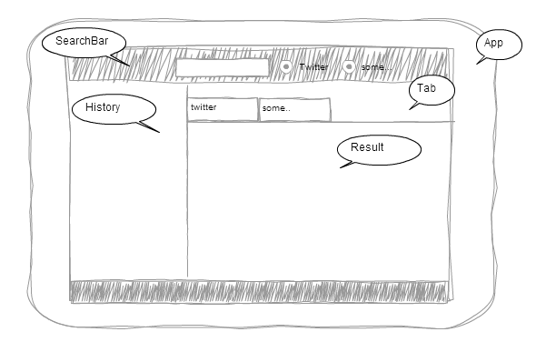
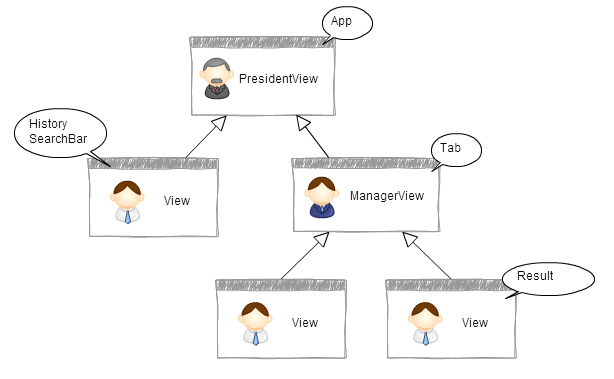
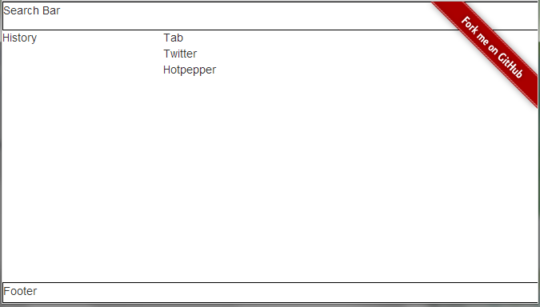
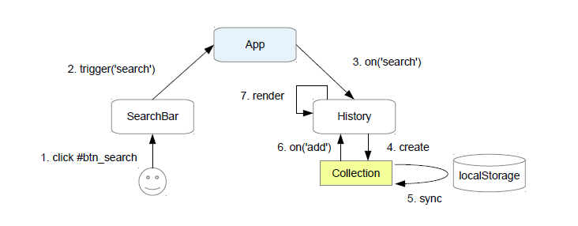
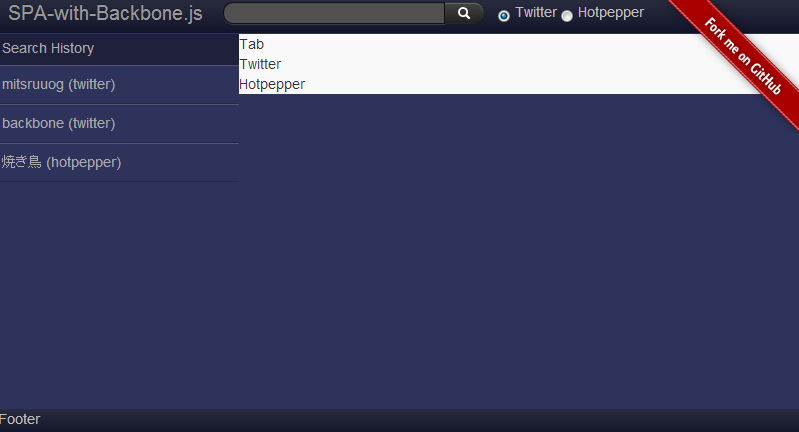
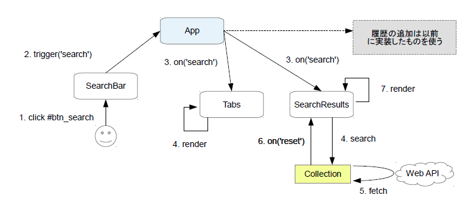
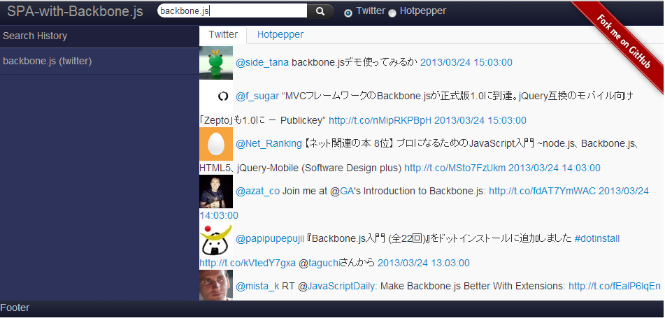
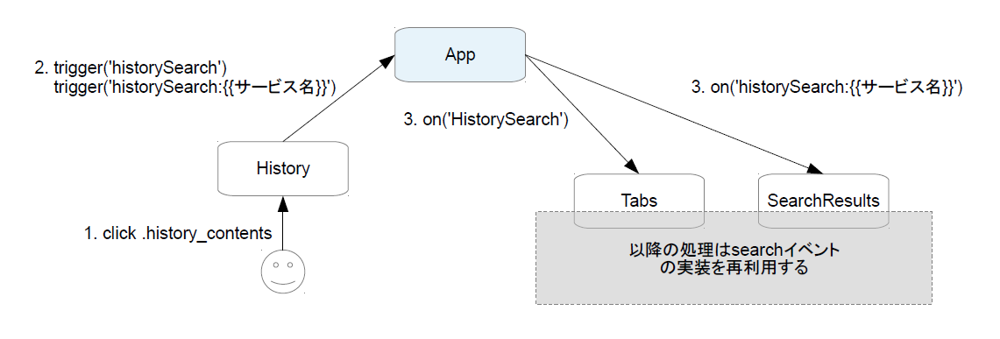
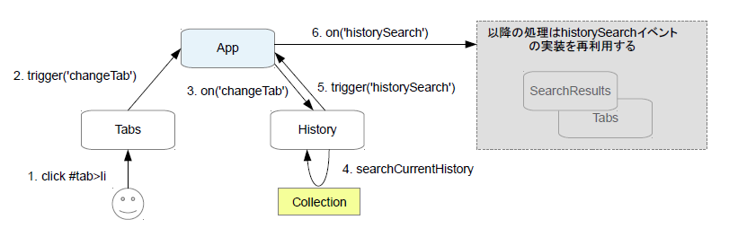

# Backbone.jsでSingle page アプリケーションを作る方法
### How to build single page application with Backbone.js

=================
## <a name='mokuji'>目次</a>
1. [はじめに](#intro)
1. [ワイアーフレーム](#wireframe)
1. [ページ構成・使用ライブラリ](#pageStructure)
1. [View統治ポリシー](#viewManagePolicies)
1. [イベント統治ポリシー](#eventManagePolicies)
1. [ワイアーフレーム作成](#makeWireframe)
1. [SearchBarからHistoryへのイベント伝播](#searchToHistory)
1. [SearchBarからSearchResultへのイベント伝播](#searchToResult)
1. [HistoryからSearchResultへのイベント伝播](#historyToResult)
1. [Tabから他のViewへのイベント伝播](#tabToOther)
1. [仕上げ](#finish)
1. [まとめ](#summary)
 
## <a name='intro'>はじめに</a>

Backbone.jsでアプリケーションを作成した際に、Viewが大きくなるという経験をしたことがある方も多いと思います。Viewが肥大化した場合、私達はViewをある単位の塊りで分割しようと試みるのですが、どのように分割するのが最善かという事は常に頭を悩ませるポイントです。

さらに、Viewを細かく分割した場合、それらをどのように結合してアプリケーションを作成するのが最善かという、新しい悩みも生まれます。

このチュートリアルでは、これらView分割に起因する問題についての私なりの最善策です。もちろんBackbone.jsでアプリケーションを作る方法は一つではありませし、View以外にまつわる問題が存在することも事実です。今回はそれら別の問題があることも認めつつ、Backbone.jsでアプリケーションを作る上で、まず最初に直面するView分割と結合に重点を置いて説明します。

## <a name='wireframe'>ワイアーフレーム</a>

作成するアプリケーションは幾つかのViewで構成されます。

* SearchBar：Webサービスに対してキーワード検索する。検索した場合、Historyに履歴が追加され、Resultsに結果が表示される。
* History：検索履歴。検索履歴をクリックすることで再検索することができる。
* Tab：Resultに表示する検索サービスを切り替えることができる。
* Result：検索結果を表示する。

ワイアーフレームのイメージは次の通りです。



## <a name='pageStructure'>ページ構成</a>

### ページ構成・使用ライブラリ

ページ構成は以下の通りです。


### 使用ライブラリ

以下のライブラリを使用しています。

* Backbone.js
* Underscore.js
* jQuery
* backbone.localStorage.js
* moment.js
* handlebars.js（任意）

デザインはBootstrapです。

###　補足

テンプレートエンジンにhandlebars.jsを利用しています。
こちらはUnderscore.jsのtemplateや他のテンプレートエンジンで代用することも可能です。

また、CSSプリプロセッサにStylusを利用していますが、この説明ではコンパイル後のピュアなCSSをベースに話を進めていきます。（とは言っても、CSSがメインテーマではないため、ほとんど話には登場しません。）

これらにはビルドプロセスが必須ですので、Gruntを使ってビルドしています。
Gruntの設定については詳しく説明しませんが、Gruntfile.jsは[こちら](https://github.com/mitsuruog/SPA-with-Backbone/blob/master/Gruntfile.js)を参考にしてください。

## <a name='viewManagePolicies'>View統治ポリシー</a>

Viewは「ManagerView」と「SubView」の2つに分類し、アプリケーションのトップレベルにあるManagerViewを特別に「PresidentView」と呼びます。
ManagerViewはSubViewのオブジェクトを保持し、管理するSubViewを外側から制御する責務（Viewの切り替えなど）のみを持ちます。
それに対して、SubViewは自身が管理するCollectionやModelを持ち、SubView自身を内側から制御する責務（レンダリングなど）や、CollectionやModelとの同期を行う責務を持ちます。

PresidentViewはアプリケーションが初期化される際に初期化され、
配下のManagerViewやSubViewのオブジェクトを生成し、アプリケーションを構築します。
また、後で言及するグローバルレベルのイベントを統括します。

| View | 主な責務 | 備考 |
|:-----------|:------------|:------------|
| PresidentView| アプリケーションのトップレベル。初期化時に他のViewの初期化||
| ManagerView| SubViewの管理と外側のみの制御||
| SubView| CollectionやModelとの同期。SubView内部のみの制御||


本アプリケーションでの、Viewの構成は次のようになります。



## <a name='eventManagePolicies'>イベント統治ポリシー</a>

## <a name='makeWireframe'>ワイアーフレーム作成</a>

では、早速ワイアーフレームを実装していきます。ソースコードは次の通りです。

**index.html**
````html
<!DOCTYPE html>
<!--[if lt IE 7 ]> <html lang="ja" class="no-js ie6"> <![endif]-->
<!--[if IE 7 ]>    <html lang="ja" class="no-js ie7"> <![endif]-->
<!--[if IE 8 ]>    <html lang="ja" class="no-js ie8"> <![endif]-->
<!--[if IE 9 ]>    <html lang="ja" class="no-js ie9"> <![endif]-->
<!--[if (gt IE 9)|!(IE)]><!--> <html lang="ja" class="no-js"> <!--<![endif]-->
<head>
  <meta charset="utf-8" />
  <meta name="description" content="" />
  <meta name="author" content="" />
  <title>How to build single page application with Backbone.js</title>
  <link href="css/main.css" rel="stylesheet" media="screen" />
</head>
<body>

  <a href="https://github.com/mitsuruog/SPA-with-Backbone.git"></a>
  <!--app root  -->
  <div id="app"></div>
  
  <script type="text/javascript" src="https://ajax.googleapis.com/ajax/libs/jquery/1.9.1/jquery.min.js"></script>
  <!--[if lt IE 9]>
    <script src="http://html5shiv.googlecode.com/svn/trunk/html5.js"></script>
  <![endif]-->
  <script type="text/javascript" src="assets/js/underscore-1.4.4.js"></script>
  <script type="text/javascript" src="assets/js/backbone-0.9.10.js"></script>
  <script type="text/javascript" src="assets/js/handlebars-1.0.0-rc.3.js"></script>
 
  <script type="text/javascript" src="js/namespace.js"></script>
  <script type="text/javascript" src="js/templates/layout.js"></script>
  <script type="text/javascript" src="js/views/search_bar.js"></script>
  <script type="text/javascript" src="js/views/tabs.js"></script>
  <script type="text/javascript" src="js/views/search_results.js"></script>
  <script type="text/javascript" src="js/views/history.js"></script>
  <script type="text/javascript" src="js/views/footer.js"></script>
  <script type="text/javascript" src="js/app.js"></script> 
 
</body>
</html>
````
**js/namespace.js**
````javascript
var MyApp = {
  Models: {},
  Collections: {},
  Vews: {},
  App: {},
  Templates: {}
};
````
**js/app.js**

`App`Viewでは、アプリケーションを構築するViewを初期化して保持します。初期化する際に、各Viewが管理を担当するセレクタを渡します。

最後の`new MyApp.App();`はこのアプリケーションを実行するための指示です。

````javascript
MyApp.App = Backbone.View.extend({

  el: '#app',

  tmpl: MyApp.Templates.layout,

  initialize: function () {

    this.$el.html(this.tmpl());

    this.history = new MyApp.Views.History({
      el: this.$el.find('#history_list')
    });

    this.searchBar = new MyApp.Views.SearchBar({
      el: this.$el.find('#header')
    });

    this.tabs = new MyApp.Views.Tabs({
      el: this.$el.find('#search_results')
    });

    this.footer = new MyApp.Views.Footer({
      el: this.$el.find('#footer')
    });

  }

});

new MyApp.App();
````
**js/views/search_bar.js**
````javascript
MyApp.Views.SearchBar = Backbone.View.extend({

  tmpl: MyApp.Templates.search_bar,

  initialize: function() {
    this.$el.html(this.tmpl());
  }

});
````

**js/views/history.js**
````javascript
MyApp.Views.History = Backbone.View.extend({

 tmpl: MyApp.Templates.history,

  initialize: function () {
    this.$el.html(this.tmpl());
  }

});
````

**js/views/tabs.js**

`Tabs`Viewでは、管理するSubViewが必要とするパラメータを渡してViewを初期化します。

````javascript
MyApp.Views.Tabs = Backbone.View.extend({

 tmpl: MyApp.Templates.tabs,

  initialize: function () {
    
    this.$el.html(this.tmpl());

    this.twitters = new MyApp.Views.SearchResults({
      el: this.$el.find('#twitter_list'),
      tmpl: MyApp.Templates.twitter
    });

    this.hotppepers = new MyApp.Views.SearchResults({
      el: this.$el.find('#hotpepper_list'),
      tmpl: MyApp.Templates.hotpepper
    });

  }

});
````

**js/views/search_result.js**

`SearchResults`Viewでは、ManagerViewから渡されたテンプレート関数`tmpl`を実行し、管理セレクタ`el`配下にDOMを構築します。
````javascript
MyApp.Views.SearchResults = Backbone.View.extend({

 initialize: function () {
    this.$el.html(this.options.tmpl());
  }

});
````

**js/views/footer.js**
````javascript
MyApp.Views.Footer = Backbone.View.extend({

  tmpl: MyApp.Templates.footer,

  initialize: function() {
    this.$el.html(this.tmpl());
  }

});
````

**hbs/layput.hbs**
````html
<header id="header-wrap">
 <div id="header-container">
    <div id="header">
    </div>
  </div>
</header>

<div id="container">

  <div id="history">
    <div id="history_title"></div>
    <div id="history_list"></div>
  </div>

  <div id="search_results">
  </div>

</div>

<footer id="footer-wrap">
  <div id="footer-container">
    <div id="footer"></div>
  </div>
</footer>
````

**hbs/*.hbs**

残りのテンプレートは特に何もしていないため、さらっと流します。
````html
// hbs/search_bar.hbs
Search Bar

// hbs/history.hbs
History

// hbs/tabs.hbs
Tab
<div id="twitter_list"></div>
<div id="hotpepper_list"></div>

// hbs/twitter.hbs
Twitter

// hbs/hotppeper.hbs
Hotppeper

// hbs/footer.hbs
Footer

````

**css/main.css**
````css
@charset "utf-8";
body {
  margin: 0;
  padding: 0;
}
#header-wrap {
  position: fixed;
  top: 0;
  left: 0;
  width: 100%;
}
#header-container {
  height: 34px;
}
#header {
  width: 100%;
  margin: 0 auto;
  position: relative;
}
#container {
  margin: 0 auto;
  overflow: auto;
  padding-top: 35px;
  padding-bottom: 25px;
}
#history {
  float: left;
  width: 30%;
}
#search_results {
  float: right;
  width: 70%;
}
#footer-wrap {
  position: fixed;
  bottom: 0;
  left: 0;
  width: 100%;
}
#footer-container {
  height: 24px;
}
#footer {
  width: 100%;
  margin: 0 auto;
  position: relative;
}
header,
footer {
  border: 1px solid #000;
}
````
これらをブラウザで表示させると、次のようなワイアーフレームが表示されるはずです。



ソースコード一式は[こちらのブランチ](https://github.com/mitsuruog/SPA-with-Backbone/tree/phase-1)で参照できます。


## <a name='searchToHistory'>SearchBarからHistoryへのイベント連携</a>

これから説明していく各サブビュー間のイベント連携は、PresidentViewが所有するMediatorオブジェクトを仲介して行います。

まず、SearchBarからHistoryへのイベント連携から説明していきます。

ユーザが検索ボタンをクリックした場合、SearchBarは`click`イベントをハンドリングし、Globalレベルのイベント`search`を発火します。
Historyでは`search`イベントをハンドリングして、localStorageに検索条件などを記録します。

これらを図にしたものが次の図です。



**js/app.js**

Globalレベルのイベントを統括するMediatorオブジェクトを作成して保有しておきます。

ここでのポイントは

HistoryViewを初期化する際に、管理させるCollectionオブジェクトを外部から渡すことです。
外部から管理するオブジェクトを渡すことで、管理する機能（View）と管理対象（Collection）を分離します。
これ後々、管理対象をLocalStorageからRDBMSなどの置き換えを行う際、Collectionのみの置き換えで実現させるためです。

````javascript
MyApp.App = Backbone.View.extend({

  el: '#app',

  tmpl: MyApp.Templates.layout,

  initialize: function () {

    //Mediator作成
    MyApp.mediator = {};
    _.extend(MyApp.mediator, Backbone.Events);
    
    this.$el.html(this.tmpl());

    this.history = new MyApp.Views.History({
      el: this.$el.find('#history_list'),
      searches: new MyApp.Collections.SearchHistoryList()
    });

  // some...

  }

});

new MyApp.App();
````

**js/views/search_bar.js**

検索ボタンがクリックされた際に発生する`click`イベントをハンドリングして`search()`を呼び出します。

`search()`の内部でGlobalレベルのイベント`search`を発火します。

````javascript
MyApp.Views.SearchBar = Backbone.View.extend({

 tmpl: MyApp.Templates.search_bar,

 //Localレベルイベントの定義
  events: {
    'click #btn_search': 'search'
  },

  // some...

  search: function (e) {

    var $checked = this.$el.find('input[type=radio]:checked'),
      query = $('#query').val(),
      service = $checked.val(),
      search = {};

    e.preventDefault();

    search.query = query;
    search.service = service;

   //「search」イベントを発火する
   MyApp.mediator.trigger('search', search);

  }

});
````

**js/views/History.js**

Globalレベルのイベント`search`をハンドリングして`addHistory()`を呼び出し、その中でCollectionオブジェクトに検索履歴を1件追加します。
Collectionオブジェクトは内部でLocalStorageと自動的に同期します。

Collectionを追加すると`add`イベントが発火するので、これをハンドリングして`render()`を呼び出し、画面に描画を行います。

ちなみに、検索履歴の削除ボタンをクリックした際に、LocalStorageから履歴を削除する実装も行っています。
Localレベルのイベントを、SubView自身で処理する際の参考実装としてください。

ここでのポイントは

まず、`initialize()`での`_.bindAll(this)`です。
今回のように、Mediatorオブジェクトを介したイベント駆動型で実装した場合、javascript特有のthisの喪失が多発します。
_.bindAllすることで、常にthisはViewオブジェクトを指し示します。

2つめは、イベントハンドリングからレンダリング`render()`までの処理の流れです。
これは、`ハンドリング→（レンダリング・データの更新）`の順ではなく、`ハンドリング→データの更新→レンダリング`となっている点で、
基本的にイベントが起点となって各処理が実行されるようになっています。
ハンドリング、データの更新、レンダリングの各処理をイベントで疎結合にすることで、
それぞれ依存することなく単独でテストしやすくなります。

````javascript
MyApp.Views.History = Backbone.View.extend({

  tmpl: MyApp.Templates.history,

  //Localレベルイベントの定義
  events: {
    'click .btn_delete': 'removeHistory'
  },

  initialize: function () {

    _.bindAll(this);

    this.searches = this.options.searches;

    this.searches.fetch();
    this.render();
  
    //Globalレベルイベントをバインド
    MyApp.mediator.on('search', this.addHistory);

    //Localレベルイベントをバインド
    this.searches.on('add remove', this.render);

  },

  addHistory: function (search) {

    search.id = +new Date();
    this.searches.create(search);

  },

  removeHistory: function (e) {

    var id = this._getHistory(e).id;
    this.searches.get(id).destroy();

  },

  render: function () {

    this.$el.html(this.tmpl({
      history: this.searches.toJSON()
    }));

  },
  
  _getHistory: function (e) {

    var history = {},
    $target = $(e.target).closest('.history');

    history.id = $target.attr('data-id');
    history.service = $target.find('.service').text().replace(/^\(|\)$/g, '');
    history.query = $target.find('.query').text();

    return history;

  }

});
````

**js/collections/search_history_list.js**

Collectionの中身はLocalStorageに記録するユニークなキーを設定します。

````javascript
MyApp.Collections.SearchHistoryList = Backbone.Collection.extend({
  
 localStorage: new Backbone.LocalStorage('mitsuruog_SPA_searchHistory')
  
});
````

**hbs/search_bar.hbs**

検索条件欄のテンプレートです。ここではTwitter Bootstrapを使用しています。

````html
<div class="navbar navbar-inverse">
  <div class="navbar-inner">
   <a class="brand" href="#" title="How to build single page application with Backbone.js">SPA-with-Backbone.js</a>
   <div class="nav-collapse collapse navbar-inverse-collapse">
     <form class="form-search navbar-search pull-left" action="">
       <div class="input-append">
         <input type="text" name="query" id="query" value="" class="search-query" />
         <button id="btn_search" class="btn btn-inverse">
           <i class="icon-search icon-white"></i>
         </button>
       </div>
       <div id="search_types">
         <input type="radio" name="service" id="twitter" value="twitter" />
         <label for="twitter" class="inline">Twitter</label>
         <input type="radio" name="service" id="hotpepper" value="hotpepper" />
         <label for="hotpepper">Hotpepper</label>
       </div>
     </form>
   </div>
  </div>
</div>
````

**hbs/history.hbs**

handlebars.jsでの繰り返し処理です。
template関数に渡された引数オブジェクトの中の`history`を繰り返します。

````html
{{#each history}}
<ul class="history" data-id="{{this.id}}">
  <li class="history_contents">
    <span class="query">{{this.query}}</span>
    <span class="service">({{this.service}})</span>
  </li>
  <li class="history_buttons">
    <i class="icon-remove-sign icon-white btn_delete"></i>
  </li>
</ul>
{{/each}}
````

**css/main.css**
````css
 @charset  "utf-8";
body {
  margin: 0;
  padding: 0;
  color: #333;
  background: #2d335b;
}
ul,
ol {
  margin: 0;
}
#header-wrap  {
  position: fixed;
  top: 0;
  left: 0;
  width: 100%;
}
#header-container  {
  height: 34px;
  background: -webkit-gradient(linear, left top, left bottom, color-stop(0, #292c3e), color-stop(1, #13152a));
  background: -webkit-linear-gradient(top, #292c3e 0%, #13152a 100%);
  background: -moz-linear-gradient(top, #292c3e 0%, #13152a 100%);
  background: -o-linear-gradient(top, #292c3e 0%, #13152a 100%);
  background: -ms-linear-gradient(top, #292c3e 0%, #13152a 100%);
  background: linear-gradient(top, #292c3e 0%, #13152a 100%);
  color:  #bfbfbf ;
}
#header  {
  width: 100%;
  margin: 0 auto;
  position: relative;
}
#search_types  {
  margin-left: 10px;
  display: inline;
}
.search-query {
  -webkit-border-radius: 4px;
  border-radius: 4px;
}
.navbar-inverse .navbar-inner {
  background: transparent;
  border: none;
}
#container  {
  margin: 0 auto;
  overflow: auto;
  padding-top: 35px;
  padding-bottom: 25px;
}
#history  {
  float: left;
  width: 30%;
  background: #2d335b;
  color:  #aaa ;
}
#history_title  {
  background-color: #1f203b;
  height: 23px;
  padding: 4px;
}
.history {
  border-bottom: 1px solid rgba(0,0,0,0.2);
  -webkit-box-shadow: rgba(170,170,170,0.3) 0 1px 0 inset;
  box-shadow: rgba(170,170,170,0.3) 0 1px 0 inset;
  padding: 9px 4px;
}
.history:hover {
  background-color: #1f203b;
}
.history .btn_delete {
  visibility: hidden;
}
.history:hover .btn_delete {
  visibility: visible;
}
.history {
  zoom: 1;
}
.history:before,
.history:after {
  content: "";
  display: table;
}
.history:after {
  clear: both;
}
#history_list  li {
  list-style-type: none;
  float: left;
}
.history_buttons {
  float: right !important;
}
#search_results  {
  float: right;
  width: 70%;
  background:  #f9f9f9 ;
}
#footer-wrap  {
  position: fixed;
  bottom: 0;
  left: 0;
  width: 100%;
}
#footer-container  {
  height: 24px;
  background: -webkit-gradient(linear, left top, left bottom, color-stop(0, #292c3e), color-stop(1, #13152a));
  background: -webkit-linear-gradient(top, #292c3e 0%, #13152a 100%);
  background: -moz-linear-gradient(top, #292c3e 0%, #13152a 100%);
  background: -o-linear-gradient(top, #292c3e 0%, #13152a 100%);
  background: -ms-linear-gradient(top, #292c3e 0%, #13152a 100%);
  background: linear-gradient(top, #292c3e 0%, #13152a 100%);
  color:  #bfbfbf ;
}
#footer  {
  width: 100%;
  margin: 0 auto;
  position: relative;
}
````
これらをブラウザで表示させると、次のような画面が表示されるはずです。



ソースコード一式は[こちらのブランチ](https://github.com/mitsuruog/SPA-with-Backbone/tree/phase-1)で参照できます。

## <a name='searchToResult'>SearchBarからSearchResultへのイベント伝播</a>

前のパートでは、SearchBarからHistoryまでのイベント連携について説明しました。
このパートでは、SearchBarからSearchResultへの連携について説明します。
_実際のアプリケーションではHotpepperの検索サービスも実装していますが、冗長なので今回はTwitterに絞って説明します。_

検索ボタンをクリックした際に新たに`search:serviceName`イベントを発火します。
TabsViewとSearchResultsViewにてハンドリングしてそれぞれ処理を行います。
TabsViewでは、タブの表示制御を行います。SearchResultsViewではWebAPIを呼び出して結果をレンダリングします。

これらの流れを図にしたものが以下の図です。



**js/views/search_bar.js**

新たに`search:serviceName`イベントを発火します。

````javascript
MyApp.Views.SearchBar = Backbone.View.extend({

  // some...

  search: function (e) {

    // some...

    //「search」「search:イベント名」イベントを発火する
    MyApp.mediator.trigger('search', search);
    MyApp.mediator.trigger('search:' + service, search);

  }

});
````

**js/views/tabs.js**

ManagerViewです。管理するSubViewを作成して保有しておきます。
Globalレベルの`search`イベントをハンドリングして`selectTab()`にてタブ表示の切り替えを行います。

ここでのポイントは

SubViewを初期化する際に、SubViewの管理対象を外部から渡たすことです。
これにより、SearchResultsViewの内部実装を変えることなく、検索サービスを増やすことが出来ます。

````javascript
MyApp.Views.Tabs = Backbone.View.extend({

 tmpl: MyApp.Templates.tabs,

  initialize: function () {
    
    this.$el.html(this.tmpl());

    this.twitters = new MyApp.Views.SearchResults({
      
      el: this.$el.find('#twitter_list'),
      tmpl: MyApp.Templates.twitter,
      collections: new MyApp.Collections.TwitterList(),
      service: 'twitter'
      
    });

    this.hotppepers = new MyApp.Views.SearchResults({
      
      el: this.$el.find('#hotpepper_list'),
      tmpl: MyApp.Templates.hotpepper,
      collections: new MyApp.Collections.HotpepperList(),
      service: 'hotpepper'
      
    });
    
    //Globalレベルイベントをバインド
    MyApp.mediator.on('search', this.selectTab);

  },
  
  selectTab: function(search){
  
    $('a[href^=#' + search.service + ']').tab('show');
  
  }

});
````

**js/views/search_results.js**

Globalイベントの`search:serviceName`イベントをハンドリングして`search()`を呼び出します。
`search()`はこのViewが持つCollectionの共通インターフェースで、実際の処理は各Collectionの`search()`にて記述します。

`search()`の内部ではWebAPIを呼び出して結果をCollectionに格納します。その際に`reset`イベントが発火されるので、
これをハンドリングして`render()`を呼び出しレンダリングします。
レンダリングする際のテンプレートはManagerViewから渡されます。

ここでのポイントは

SubViewは出来る限り機能を抽象化して、必要なものはView生成時に外部から渡すことです。
これによりSubViewが再利用できます。

````javascript
MyApp.Views.SearchResults = Backbone.View.extend({

 initialize: function () {
    
    _.bindAll(this);

    this.collections = this.options.collections;
    this.tmpl = this.options.tmpl;
    this.service = this.options.service;

    //Globalレベルイベントをバインド
    MyApp.mediator.on('search:' + this.service, this.search);

    //Localレベルイベントをバインド
    this.collections.on('reset', this.render);
    
  },
  
  
  search: function(search){

    this.collections.search(search);

  },

  render: function () {

    this.$el.html(this.tmpl({
      models: this.collections.toJSON()
    }));

  }
  
});
````

**js/collections/twitter_list.js**

Collectionでは実際のWebAPIにFetchするための情報を定義します。

ここでのポイントは

WebAPIから取得したJSONが（ネストしている場合など）そのままではCollectionとして利用できない場合、
`parse()`にてJSONオブジェトから必要な部分を抜き出し、後方のメソッドに渡しているところです。
Viewで同様のことを行う実装を時々見かけますが、ロジックが分散してしまうのであまりお勧めしません。

下の例では`response.results`にtweetのArrayが格納されています。

````javascript
MyApp.Collections.TwitterList = Backbone.Collection.extend({

  url: 'http://search.twitter.com/search.json',

  model: MyApp.Models.Twitter,

  search: function (param) {

    this.fetch({
      data: {
        q: encodeURIComponent(param.query)
      },
      dataType: 'jsonp'
    });

  },

  parse: function (response, options) {

    this.response = response;

    return response.results;

  }

});
````

**js/models/twitter.js**

Modelではtweetの中のリンク（っぽい）文字列のリンク化と日付のフォーマットを行っています。

````javascript
MyApp.Models.Twitter = Backbone.Model.extend({

 set: function (attrs, options) {

    if (attrs.text) {
      attrs.text_linked = twttr.txt.autoLink(attrs.text);
    }
    if (attrs.created_at) {
      attrs.created_at = moment(attrs.created_at).format('YYYY/MM/DD HH:MM:SS');
    }

    return Backbone.Model.prototype.set.call(this, attrs, options);
  }

});
````

**hbs/tabs.hbs**

TwitterとHotpepperタブのテンプレートです。

````html
<ul id="tab" class="nav nav-tabs">
  <li class="active" data-toggle="tab" data-service="twitter">
    <a href="#twitter_list">Twitter</a>
  </li>
  <li class="" data-toggle="tab" data-service="hotpepper">
    <a href="#hotpepper_list">Hotpepper</a>
  </li>
</ul>
<div id="tab-content" class="tab-content">
  <div class="tab-pane active" id="twitter_list" data-service="twitter"></div>
  <div class="tab-pane" id="hotpepper_list" data-service="hotpepper"></div>
</div>
````

**hbs/tabs.twitter.hbs**

ここでは`models`を繰り返しています。

````html
<ul id="twitter_list">
  {{#each models}}
    <li>
      <span class="img">
        
      </span>
      <span class="author">
        <a href="https://twitter.com/{{this.from_user}}" target="_blank">@{{this.from_user}}</a></span>
        <span class="body">{{{this.text_linked}}}</span>
        <span class="time"><a href="https://twitter.com/{{this.from_user}}/status/{{this.id_str}}" target="_blank">{{this.created_at}}</a>
      </span>
    </li>
    {{/each}}
</ul>
````
これで、検索ボタンをクリックしてから、結果を表示するまでの一連の機能が実装できました。
アプリケーションを実行した場合、次のように表示されるはずです。



ソースコード一式は[こちらのブランチ](https://github.com/mitsuruog/SPA-with-Backbone/tree/phase-3)で参照できます。


## <a name='historyToResult'>HistoryからSearchResultへのイベント連携</a>

続いて、HistoryからSearchResultへのイベント連携部分について説明していきます。

HistoryViewにて検索履歴をクリックしたした際に、Globalイベント`historySearch`と`historySearch:serviceName`を発火します。
TabsViewでは`historySearch`を、SearchResultsViewでは`historySearch:serviceName`をハンドリングしてそれぞれ処理を行います。
処理はSearchBarからSearchResultへのイベント連携で作成したものをそのまま流用します。



**js/views/history.js**

検索履歴の`click`イベントを監視して、`historySearch`と`historySearch:serviceName`を発火させます。

````javascript
MyApp.Views.History = Backbone.View.extend({

	tmpl: MyApp.Templates.history,

	events: {
		'click .btn_delete': 'removeHistory',
		
		//履歴クリック時のLocalイベントを監視して、searchHistory()を呼び出す
		'click .history_contents': 'searchHistory'
	},

	// some ...
	
	searchHistory: function(e){
	
		var history = this._getHistory(e);
		
		//Globalイベント「historySearch」を発火する
		MyApp.mediator.trigger('historySearch', history);
		MyApp.mediator.trigger('historySearch:' + history.service, history);	
	},
	
	// some ...

});
````

**js/views/tabs.js**

Globalイベント`historySearch`を監視します。

````javascript
MyApp.Views.Tabs = Backbone.View.extend({

	tmpl: MyApp.Templates.tabs,

	initialize: function () {

		// some ...
		
		//履歴クリック時のGlobalイベントを監視して、selectTab()を呼び出す
		MyApp.mediator.on('search historySearch', this.selectTab);

	},
	
	// some ...

});
````

**js/views/search_results.js**

Globalイベント`historySearch:serviceName`を監視します。

````javascript
MyApp.Views.SearchResults = Backbone.View.extend({

	initialize: function () {
		
		// some ...
		
		MyApp.mediator.on('search:' + this.service, this.search);
		
		//履歴クリック時のGlobalイベントを監視して、search()を呼び出す
		MyApp.mediator.on('historySearch:' + this.service, this.search);

		this.collections.on('reset', this.render);
		
	},
	
	// some ...
	
````

これで、検索履歴から再検索できるようになりました。

それぞれのSubViewの連携をイベントで行うことで部品の再利用が進みます。

ソースコード一式は[こちらのブランチ](https://github.com/mitsuruog/SPA-with-Backbone/tree/phase-4)で参照できます。

## <a name='tabToOther'>Tabから他のViewへのイベント連携</a>

最後は、Tabから他のViewへのイベント連携の部分を説明していきます。

タブをクリックした際にGlobalイベント`changeTab`を発火します。
HistoryViewでは`changeTab`を監視し、検索履歴のCollection内から該当するサービスの最も直近に検索したキーワードを探し出します。
その後は、HistoryからSearchResultへのイベント連携部分をそのまま使います。



**js/views/tabs.js**

タブの`click`イベントを監視して、Globalイベント`changeTab`を発火します。

````javascript
MyApp.Views.Tabs = Backbone.View.extend({

	tmpl: MyApp.Templates.tabs,

	//Tabクリック時のLocalイベントを監視して、changeTab()を呼び出す
	events: {
		'click #tab>li': 'changeTab'
	},

	// some ..

	changeTab: function (e) {

		var service = this._getService(e.currentTarget);
		
		//Globalイベント「changeTab」を発火する
		MyApp.mediator.trigger('changeTab', service);

	},
	
	// some ...

	_getService: function (tab) {

		return $(tab).data('service');

	}

});

````

**js/views/tabs.js**

Globalイベント`chnageTab`を監視して、直近の検索のキーワードと共に、
Globalイベント`historySearch`と`historySearch:serviceName`を発火します。

````javascript
MyApp.Views.History = Backbone.View.extend({

	// some ...

	initialize: function () {

		// some ...

		//Tabクリック時のLocalイベントを監視して、searchCurrentHistory()を呼び出す
		MyApp.mediator.on('changeTab', this.searchCurrentHistory);

		this.searches.on('add remove', this.render);

	},
	
	// some ...

	searchCurrentHistory: function (service) {

		var historys = [],
			history;

		historys = this.searches.where({
			service: service
		});
		
		if (historys.length) {

			history = historys[0].attributes;
			
			//Globalイベント「historySearch」を発火する
			MyApp.mediator.trigger('historySearch', history);
			MyApp.mediator.trigger('historySearch:' + history.service, history);

		}

	},
	
	// some ...

});
````

これで、タブをクリックした際に、再検索できるようになりました。ここでも部品の再利用が効いています。Backbone素敵！

ソースコード一式は[こちらのブランチ](https://github.com/mitsuruog/SPA-with-Backbone/tree/phase-5)で参照できます。

## <a name='finish'>仕上げ</a>

## <a name='summary'>まとめ</a>
